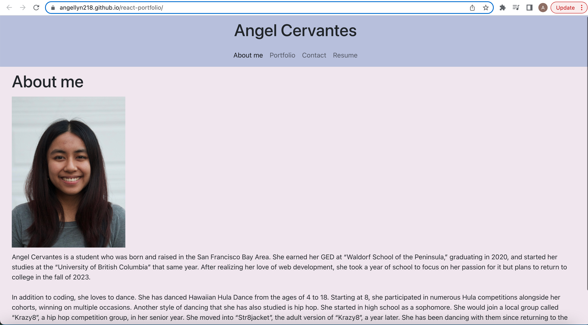
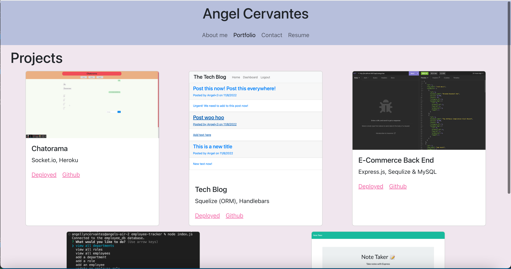
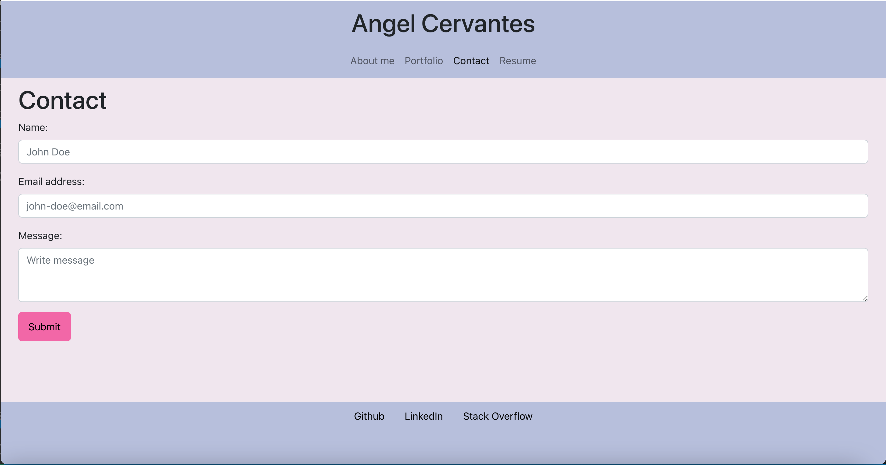

# React Portfolio

## Description

To show future employeers the skills that I learned from React, I created this portfolio website. In addition to showing off many recent projects, this website also uses the latest technologies. 

## Table of Contents

- [Installation](#installation)
- [Usage](#usage)
- [Credits](#credits)
- [License](#license)
- [Badges](#badges)

## Installation

1. Click on green code button and copy the ssh link
2. Open up terminal or git bash, then navigate to where you want the repository to be placed.
3. Type out "git clone (ssh link)"
4. Be sure to install Node.js. Node.js is necessary to run this program. If you need to, download it from the [Node.js website](https://nodejs.org/en/download/).
5. Once you have installed Node.js, navigate to inside the 'react-portfolio' folder
6. Run 'npm run install' to install packages within package.json
7. Run 'npm run build' to build the react application on your computer

## Usage

To start this program on your local computer, navigate to your react-portfolio folder. Type 'npm run start' into your terminal. This will navigate you to the default browser and open up [http://localhost:3000/react-portfolio](http://localhost:3000/react-portfolio). You can also use [my website](https://angellyn218.github.io/react-portfolio/) if you so desire.

You will then be greeted by the "About Me" page on the website's initial load.

Using the Nav bar at the top, you can Navigate to the "Portfolio" page. On this page, you will see project cards. Each card has its own image, title, important technologies used, deployed link, and gihub repo link.

Using the Nav bar, you can Navigate to the "Contact" page. You can submit your name, email, and message, then press submit to contact me.

Lastly, to see a list of my skills, click on "Resume". This will take you to the resume which has a list of my skills and a link to download my resume.

## Credits

front-end developer skills: https://bootcamp.ce.arizona.edu/blog/front-end-developer-skills/

back-end developer skills: https://www.geeksforgeeks.org/back-end-developer-skills/ 

## License

Please refer to LICENSE in this repository

## Badges

